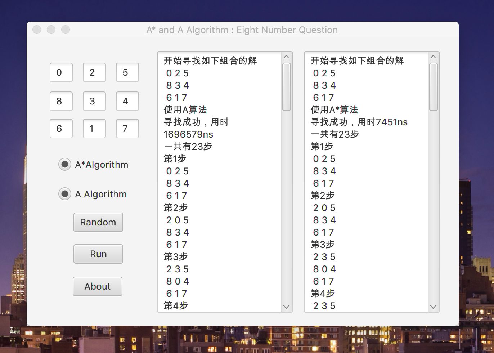

# Eight-Num-Problem
使用人工智能方法解决八数码问题。

用A算法与A*算法进行比较。

AI文件夹中是java项目以及源代码
AI.jar是可直接运行的文件，提供接口，解决八数码问题
A算法使用的估计函数是计算当前放错位置的数字数量
A*算法使用的估计函数是当前数字位置和标准位置的曼哈顿距离
有两个radiobox，可以选择使用两个算法，可以都选择，也可以只选一个
随机产生的八数码是可解的，若自己输入不可解的八数码，会报错

截图:
